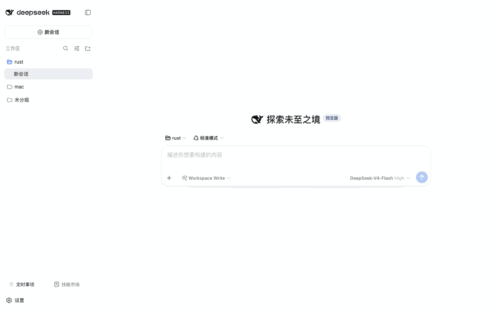

# @weibaohui/dsh-continue

[](https://github.com/topics/dsh-plugin)
[](https://www.npmjs.com/package/@weibaohui/dsh-continue)

**自动续跑插件**：agent 会话中断后自动帮你续上，不用手敲「继续」。



## 核心功能

- **自动续跑**：检测到传输错误、崩溃孤儿轮等失败后，自动向同一会话重发续跑指令，带冷却与指数退避
- **有序规则表**：不同失败类型走不同策略，从上到下先命中先用——
  - 限流（429）：自动退避重试（尊重服务商要求的等待时间），最多 5 次
  - 额度耗尽 / 鉴权失败：立即止损并通知，不白白重试
  - 上下文超限：**自动压缩会话上下文，压缩成功后继续跑**
  - 崩溃孤儿轮 / 其他错误：自动继续
- **失败后自动换模型**：同一失败连续 N 次仍不成功，后续续跑自动切换到备用模型（如主模型限流后换备用模型接着跑）
- **可视化管理**：设置页里规则、开关、次数、退避参数全部可视化编辑；provider 和模型一律下拉选择
- **全程可查**：每次续跑、换模型、停止原因都有活动日志

## 安装

```bash
dsh plugin --profile web add @weibaohui/dsh-continue -w
```

装完重启 `dsh web` 即生效。默认规则开箱可用，无需任何配置。

## 使用

1. 打开 Web UI → **设置页 → 自动续跑**
2. 总开关默认开启，默认规则表已覆盖常见失败场景
3. 想自定义：编辑规则表（匹配条件 + 动作）、调整续跑上限/退避参数、选备用模型
4. 失败发生时插件自动介入；会话里会收到续跑与停止原因的通知，活动日志在设置页可查
